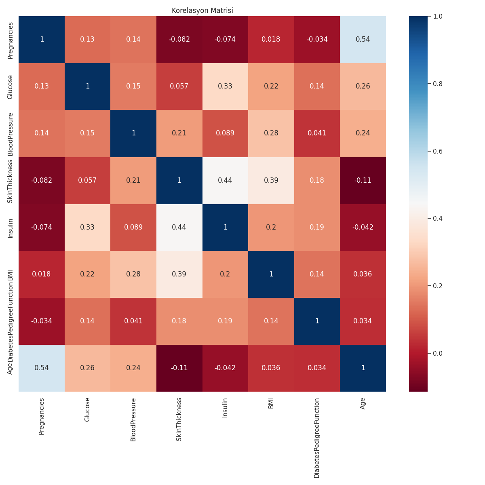
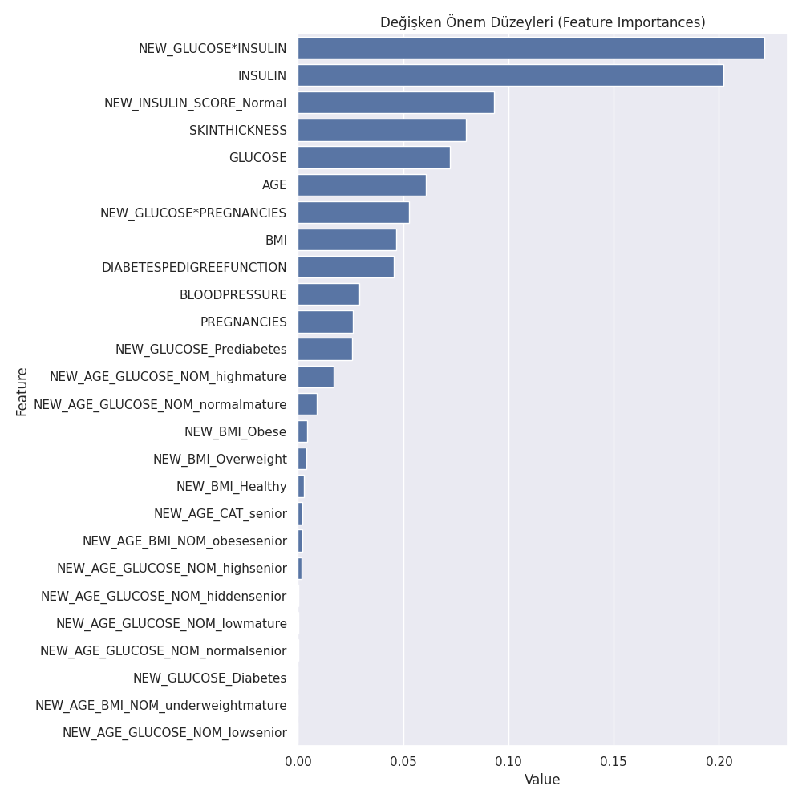

# 🩺 Diyabet Özellik Mühendisliği (Diabetes Feature Engineering)

Miuul Data Scientist Bootcamp kapsamında hazırlanan bir **Keşifçi Veri Analizi (EDA)** ve **Özellik Mühendisliği (Feature Engineering)** projesidir. Amaç, kişilerin özelliklerine bakarak diyabet hastası olup olmadıklarını tahmin edebilen bir makine öğrenmesi modeli geliştirmektir.

## 📌 İş Problemi

Özellikleri belirtildiğinde kişilerin diyabet hastası olup olmadıklarını tahmin edebilecek bir makine öğrenmesi modeli geliştirilmesi istenmektedir. Modeli geliştirmeden önce gerekli olan veri analizi ve özellik mühendisliği adımları gerçekleştirilmiştir.

## 📊 Veri Seti Hikayesi

Veri seti, ABD'deki Ulusal Diyabet-Sindirim-Böbrek Hastalıkları Enstitüleri'nde tutulan büyük bir veri setinin parçasıdır. Arizona Eyaleti'nin en büyük 5. şehri olan Phoenix'te yaşayan, 21 yaş ve üzerindeki **Pima Indian** kadınları üzerinde yapılan diyabet araştırmasına ait verileri içerir.

**9 Değişken, 768 Gözlem**

| Değişken | Açıklama |
|---|---|
| Pregnancies | Hamilelik sayısı |
| Glucose | Oral glikoz tolerans testinde 2 saatlik plazma glikoz konsantrasyonu |
| BloodPressure | Kan basıncı (küçük tansiyon, mm Hg) |
| SkinThickness | Cilt kalınlığı |
| Insulin | 2 saatlik serum insülini (mu U/ml) |
| DiabetesPedigreeFunction | Soydaki kişilere göre diyabet olma ihtimalini hesaplayan fonksiyon |
| BMI | Vücut kitle endeksi |
| Age | Yaş (yıl) |
| **Outcome** | Hedef değişken — diyabet testi pozitif (1) / negatif (0) |

## 🔧 Proje Adımları

**Görev 1: Keşifçi Veri Analizi**
- Genel resmin incelenmesi (boyut, tip, betimsel istatistikler)
- Numerik / kategorik değişkenlerin yakalanması (`grab_col_names`)
- Numerik ve kategorik değişken analizleri
- Hedef değişken analizi (kategorik kırılımda ve numerik kırılımda)
- Aykırı gözlem analizi (IQR yöntemi)
- Eksik gözlem analizi
- Korelasyon analizi

**Görev 2: Feature Engineering**
- Glikoz, kan basıncı, cilt kalınlığı, insülin ve BMI'daki fizyolojik olarak imkansız **0 değerlerinin NaN'a çevrilmesi** ve `Outcome` kırılımında medyan ile doldurulması
- Aykırı değerlerin eşik değerleriyle baskılanması (capping)
- Yaş, BMI, glikoz seviyesi ve bunların etkileşimlerinden **yeni değişkenler türetilmesi** (`NEW_AGE_CAT`, `NEW_BMI`, `NEW_GLUCOSE`, `NEW_AGE_BMI_NOM`, `NEW_AGE_GLUCOSE_NOM`, `NEW_INSULIN_SCORE`, vb.)
- Label Encoding (iki sınıflı değişkenler) ve One-Hot Encoding (çok sınıflı değişkenler)
- `StandardScaler` ile numerik değişkenlerin standartlaştırılması
- `RandomForestClassifier` ile model kurulumu ve değerlendirme

## 🤖 Model Performansı

| Metrik | Skor |
|---|---|
| Accuracy | 0.88 |
| Recall | 0.79 |
| Precision | 0.85 |
| F1 Score | 0.82 |
| AUC | 0.86 |

*(random_state sabitlenmiştir; test seti oranı %30)*

### Korelasyon Matrisi


### Değişken Önem Düzeyleri


## 📁 Proje Yapısı

```
diabetes-feature-engineering/
├── data/
│   └── diabetes.csv
├── outputs/
│   ├── correlation_matrix.png
│   └── feature_importance.png
├── diabetes_feature_engineering.py
├── requirements.txt
├── .gitignore
├── LICENSE
└── README.md
```

## 🚀 Nasıl Çalıştırılır

```bash
git clone https://github.com/<kullanici-adi>/diabetes-feature-engineering.git
cd diabetes-feature-engineering
pip install -r requirements.txt
python diabetes_feature_engineering.py
```

## 🛠️ Kullanılan Teknolojiler

- Python 3
- Pandas, NumPy
- Matplotlib, Seaborn
- Scikit-learn (RandomForestClassifier, LabelEncoder, StandardScaler)

## 📚 Kaynak

Bu proje [Miuul](https://www.miuul.com/) Data Scientist Bootcamp — Feature Engineering modülü kapsamında hazırlanmıştır. Veri seti National Institute of Diabetes and Digestive and Kidney Diseases (Pima Indians Diabetes Dataset) kaynaklıdır.

## 📄 Lisans

Bu proje [MIT Lisansı](LICENSE) ile lisanslanmıştır.
